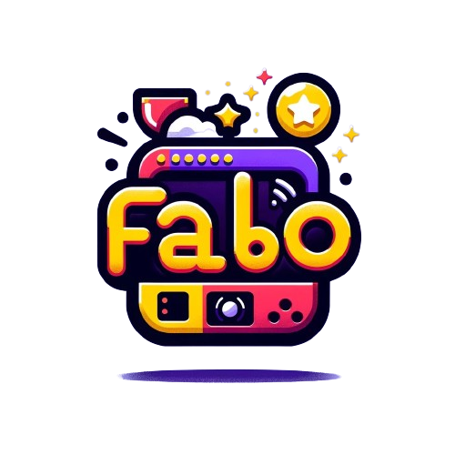

<h1 align="center">
 
</h1>

 <strong>FABO - Fabulous screen-shooter of your social media milestones</strong>
  
 A command-line FOMO tool that celebrates your social media achievements by automagically capturing screenshots of major milestones.
  
  
 <a href="https://github.com/nkkko/fabo/issues/new?assignees=&labels=bug&template=01_BUG_REPORT.md&title=bug%3A+">Report a Bug</a>
 ·
 <a href="https://github.com/nkkko/fabo/issues/new?assignees=&labels=enhancement&template=02_FEATURE_REQUEST.md&title=feat%3A+">Request a Feature</a>
 .
 <a href="https://github.com/nkkko/fabo/discussions">Ask a Question</a>

 

Table of Contents

- [About](#about)
- [Built With](#built-with)
- [Getting Started](#getting-started)
- [Roadmap](#roadmap)
- [Contributing](#contributing)
- [Support](#support)
- [License](#license)
- [Acknowledgements](#acknowledgements)

---

## About

FABO is a quirky command-line interface (CLI) tool built with the [Bubble Tea](https://github.com/charmbracelet/bubbletea) library. It tracks various social media channels for milestone events, such as when your GitHub repository reaches those 1,000 shiny stars or your LinkedIn profile gets the first 100 followers. FABO automatically captures screenshots of these milestones, allowing you to celebrate and share your social media achievements easily and without fear of missing out.

While FABO is still in its early stages, we're working hard to bring you an exciting and feature-rich tool that will make tracking your social media milestones a breeze. We can't wait to share it with you all and see what cool ideas you have to make it even better!

### Built With

- [Go](https://golang.org/)
- [Bubble Tea](https://github.com/charmbracelet/bubbletea)

## Getting Started

*FABO is currently in development, but we're cooking up something special! Installation instructions will be provided when we're ready to share this quirky creation with the world.*

## Roadmap

We have an ambitious (and maybe a little quirky) roadmap planned for FABO, with exciting features and improvements on the horizon. Stay tuned for updates on our progress and upcoming releases!

## Contributing

While FABO is still in its early stages, we welcome contributions from the community – the quirkier, the better! If you have a wild idea or a unique perspective to share, we'd love to hear it. Keep an eye on this repository for updates on when we'll officially open the doors for contributions.

## Support

If you have any questions, need assistance, or just want to chat about FABO's quirky features, feel free to open an issue on this repository, and we'll be happy to lend an ear (or a pair of eyes, since it's a written conversation)!

## License

This project is licensed under the [MIT License](LICENSE). Feel free to use it, modify it, and have a blast with it!

## Acknowledgements

We would like to express our gratitude to the creators and contributors of the following projects, which have been instrumental in the development of FABO:

- [Bubble Tea](https://github.com/charmbracelet/bubbletea) - The quirky library used for building the CLI

## Note

This is a work of fiction. Any similarity to actual events or persons, living or dead, is purely coincidental. FABO is a quirky, imaginary creation meant to bring a smile to your face.
Who knows? Maybe our little quirky project will even motivate you to create your own real-life achievement-tracking tool – just be sure to give us a shoutout if you do!
